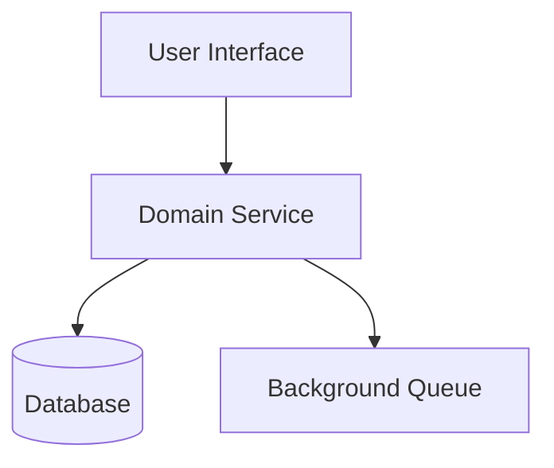
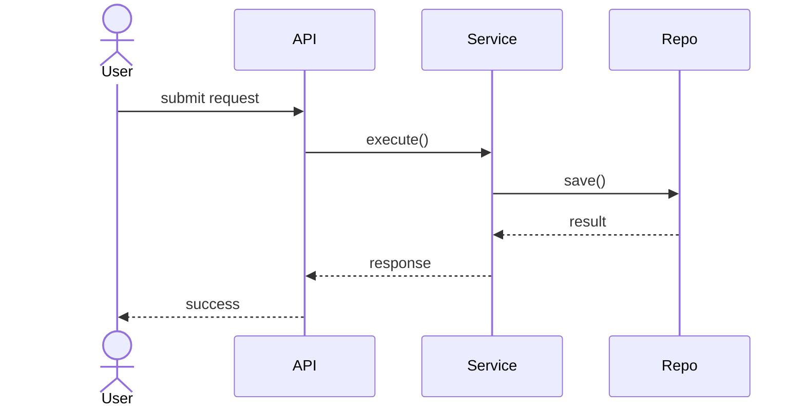
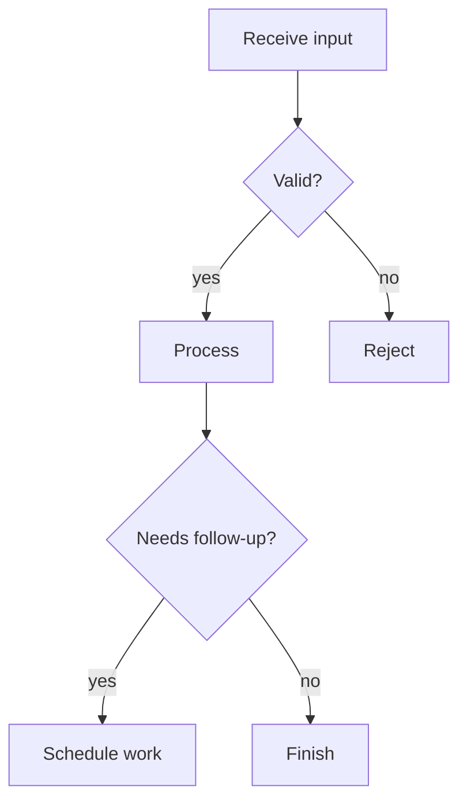

# Mermaid Diagram Patterns

Use diagrams only when they materially improve understanding.

## Component Diagram

Use for a high-level system picture when naming responsibilities and boundaries.

## Sequence Diagram

Use for request or workflow scenarios across components.

## Flowchart

Use for branching logic, policy decisions, or retry flows.

## Rules

- Prefer the smallest diagram that answers the question
- Keep labels domain-specific, not generic placeholders
- Do not draw diagrams for single-component changes unless the interaction is the hard part
